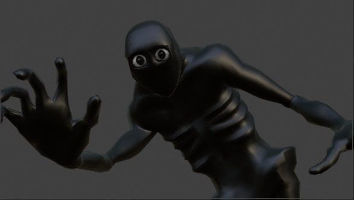

# The Monster

### James foi um cientista extraordinário, mas devido alguns experimentos ambiciosos acobou tendo seu corpo consumido pelas sombras e as almas dos condenados.

James, em sua busca por poder e conhecimento, se lançou em experimentos ousados, mas a catástrofe foi inevitável. Ao derramar a substância sobre si mesmo, seu corpo começou a se corroer e distorcer, enquanto seus olhos, monstruosamente dilatados, refletiam a corrupção que dominava sua mente. Desesperado, tentou deixar o laboratório em busca de ajuda, mas suas forças falharam. Dias se passaram, talvez semanas, enquanto ele vagava sem rumo nas profundezas do subterrâneo, consumido pela dor de sua transformação. Com o tempo, perdeu toda memória de sua identidade. O homem que um dia foi James agora se dissolvia nas sombras, esquecido de si e de seu passado. E assim, o monstro que ele se tornou passou a ser conhecido como *The Seeker*.

 

  

