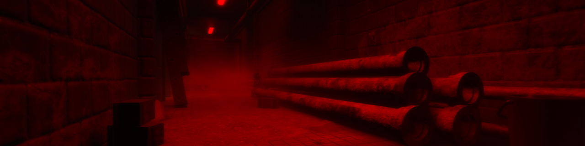
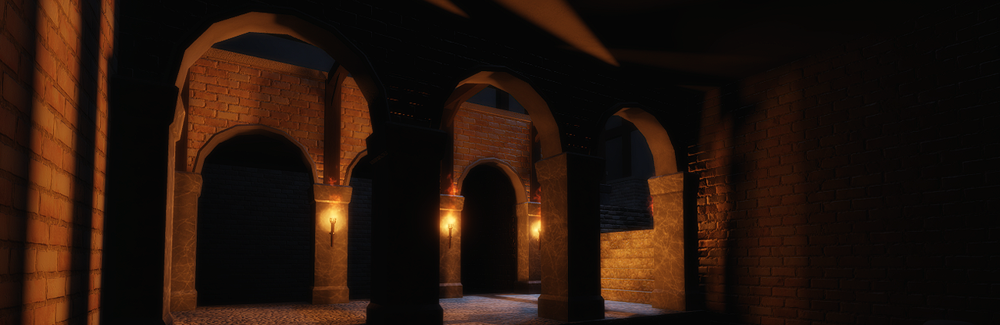

# Eyes In The Dark

### Bem-vindo à documentação do projeto **Eyes In The Dark** no Roblox! Aqui você encontrará informações sobre o desenvolvimento, estrutura, mecânicas e tudo mais relacionado ao jogo.

## Índice

1. [Visão Geral](#1-visão-geral)
2. [Objetivos do Jogo](#2-objetivos-do-jogo)
3. [Recursos do Jogo](#3-recursos-do-jogo)
4. [Mecânicas de Jogo](#4-mecânicas-de-jogo)
5. [Estrutura e Arquitetura do Projeto](#5-estrutura-e-arquitetura-do-projeto)
6. [Design de Personagens e Ambientação](#6-design-de-personagens-e-ambientação)
7. [Tecnologias Utilizadas](#7-tecnologias-utilizadas)
8. [Referências e Links Externos](#8-referências-e-links-externos)

---

## 1. Visão Geral

- **Nome do Jogo:** Eyes In The Dark
- **Data de Início do Projeto:** 06/11/2024
- **Plataforma:** Roblox
- **Desenvolvedores:** Alysson Kennedy, Geovana Rodrigues, Matheus Costa e Taís Doring.
- **Descrição:** Resumo breve do jogo, incluindo tema, narrativa e estilo.

---

## 2. Objetivos do Jogo

- **Objetivo Principal:** Colete peças por salas desafiadoras, leve-as até um altar e escape do mapa enquanto foge de um monstro.
- **Fugir do Monstro:** Entidade que persegue o jogador ao longo de toda a gameplay, com fraqueza à luz ultravioleta.
- **Escapar do Mapa:** Colete a chave dourada para abrir uma escotilha e escapar.

---

## 3. Recursos do Jogo

- **Recursos Principais:** Salas trancadas, puzzles e itens a serem coletados durante a fuga, enquanto se evita um monstro que tem medo de luz ultravioleta.
- **Itens e Equipamentos:** Usados para desbloquear salas e coletar recursos necessários para obter o item principal e escapar.

---

## 4. Mecânicas de Jogo

- **Controles e Movimentação:**
  - Computador:
    - Teclas **WASD** para movimentação do personagem.
    - Tecla **'E'** para interação com objetos.
    - Mouse para movimentação de câmera.
  - Celulares e Tablets:
    - Botões touch especiais para movimentação do personagem e interação com o ambiente.
- **Interações:** O jogador tem a possibilidade de interagir com recursos no mapa como itens.
- **Sistema de Vidas:** Jogador possui uma vida, e ao morrer para o monstro ele volta ao estágio inicial do jogo, tendo assim que refazer todo o trajeto.

---

## 5. Estrutura e Arquitetura do Projeto

- **Pastas e Organização:** Os scripts e modulos gerenciados pelos cliente são colocados em uma pasta separadas do servidor para que assim os clientes não tenham como manipular comportamentos indesejados (cheatings, explotings), os scripts do servidor são responsáveis por gerenciar as ações do jogo.
- **Estrutura de Objetos:** Os objetos visuais do jogo ficam armazenados na Workspace, enquanto recursos que podem ser usados futuramentes ficam armazenados no ReplicatedStorage ou ServerStorage(Somente o servidor tem acesso a essa pasta).
- **Fluxo de Dados e Comunicação:** Os dados entre os cliente e servidor são transitados a partir de RemotesEvents.

---

## 6. Design de Personagens e Ambientação

- **Personagens:** [**James (Monstro do Jogo)**](https://github.com/AlyssonKe/Eyes-In-The-Dark/tree/main/Monster).
- **Ambientação e Cenários:** O jogo se passa em um laborátorio abandonado, aonde James fazia seus experimentos clandestinamente.

---

## 7. Tecnologias Utilizadas

- **Linguagem de Programação:** Lua  
  Utilizada para desenvolvimento dos scripts e funcionalidades interativas do jogo.

- **Ferramenta de Edição de Imagem:** Adobe Photoshop  
  Usado para criação e ajuste de texturas, ícones e elementos visuais.

- **Modelagem 3D:** Blender  
  Utilizado para criar e editar modelos 3D personalizados.

- **Ambiente de Desenvolvimento:** Roblox Studio  
  Plataforma principal para o design, programação e construção do ambiente do jogo.

- **Gerenciamento de Projeto:** Trello  
  Ferramenta de organização para controle de tarefas, acompanhamento do progresso e colaboração entre membros da equipe.

---

## 8. Referências e Links Externos

- **API do Roblox:** https://create.roblox.com/docs/pt-br/reference/engine
  
---

O jogo ainda está em desenvolvimento e seguirá os proximos passos para que seja disponibilizado na plataforma e lançado oficialkmente no Roblox. 
